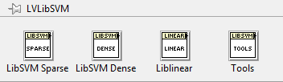

### Description
A LabVIEW wrapper for libsvm (320). An interface to liblinear (1.19) is also included.
The wrapper can currently be considered experimental, as it has not been extensively tested.

Although there exists an old wrapper for libsvm, it uses the (now) unsupported CIN interface and passes data through text files. This implementation uses Call Library Function Nodes, and passes data directly.

The implementation is thread-safe, which means that multiple cross-validation/training/predicting can be executed simultaneously. This can for example be done quick and dirty by placing the VIs in a parallel for loop.

### Installation
The easiest way to install the library is through the pre-built VIPM package found under releases.
This installs both the VIs and binary components to vi.lib. 
Currently the only supported system is windows, but unix support will be added at a later point.

The supplied binaries are compiled using Visual Studio 2013.
The wrapper is developed in LabVIEW 2014, but the distributed VIPM packages are compatible with LabVIEW 2011 and later.
Let me know if you would like me to extend support for previous versions.

### Dependencies
* libsvm and liblinear binaries (included in the VIPM package)
* OpenG Toolkit VIs (automatically installed by VIPM)
* [Visual Studio 2013 Visual C++ Redistributable](http://www.microsoft.com/en-us/download/details.aspx?id=40784) (x86 for 32bit LabVIEW, x64 for 64bit LabVIEW)

### Usage
Currently there are three examples included in the palette.
Look at the libsvm/liblinear documentation if something should be unclear. 
The documentation for the python wrapper in scikit-learn is also very useful.

The library primarily consists of VIs that more or less wrap the functions exposed through the libsvm/liblinear API.
The data structures used for these calls are relatively similar.

